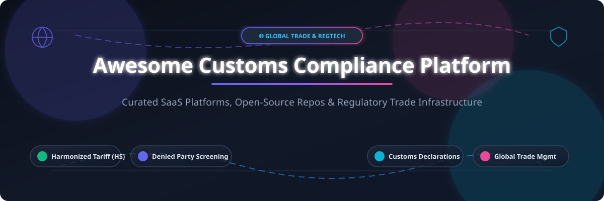

# 🌐 Awesome Customs Compliance Platform

  
  
  
  
  

---

## 🎯 Overview & Market Insights

A curated ecosystem of enterprise **SaaS software platforms** and **open-source GitHub projects** dedicated to **Customs Compliance**, **Global Trade Management (GTM)**, **Harmonized Tariff Schedule (HTS) Classification**, **Denied Party & Sanctions Screening**, and **Automated Customs Declaration Filing**.

> [!NOTE]
> **Market Size & Structure:** The Global Trade Management (GTM) and Customs Compliance Software Market is estimated at **$3.8 Billion to $4.8 Billion** globally, projected to reach **$7.5 Billion by 2030** growing at an **8.8% CAGR**. 
> 
> The sector is **moderately concentrated at the high enterprise layer** (dominated by suites like SAP GTS, Thomson Reuters, Descartes, and E2open), while remaining **highly fragmented across regional customs brokers** and localized declaration software providers due to country-specific tariff laws, filing protocols (e.g., Automated Commercial Environment / ACE in the US, CDS in the UK, ATLAS in Germany), and liability structures.

---

## 📑 Table of Contents

- [🏢 SaaS/Hosted Platforms](#-saashosted-platforms)
- [🔓 Open-Source GitHub Projects](#-open-source-github-projects)
- [🤝 How to Contribute](#-how-to-contribute)
- [💖 Support & Sponsor](#-support--sponsor)
- [📈 Star History](#-star-history)
- [⚠️ Disclaimer](#%EF%B8%8F-disclaimer)

---

## 🏢 SaaS/Hosted Platforms

The following commercial software suites represent the enterprise category leaders in cross-border customs declarations, trade compliance, tariff databases, and denied-party screening.

> **Sorted by Company Size / Market Valuation (Descending)**

| 🏢 Product Name | 💰 Company Size (Revenue / Valuation) | 💵 Starting Tier Price | 🆓 Free Tier / Trial Limits | 🔑 Core Capabilities & Regulatory Scope |
| :--- | :--- | :--- | :--- | :--- |
| **[SAP Global Trade Services (GTS)](https://www.sap.com/products/scm/global-trade-management.html)** | **~$35.0 Billion** Revenue *(~$250B Market Cap)* | **$50,000+/year** base core license | **No free plan**; 30-day SAP Cloud Appliance Library evaluation sandbox for enterprise architects. | Integrated enterprise ERP trade suite, compliance screening, automated export controls, preference management, and customs processing. |
| **[Thomson Reuters ONESOURCE Global Trade](https://www.thomsonreuters.com/en/products/onesource-global-trade.html)** | **~$7.2 Billion** Revenue *(~$75B Market Cap)* | **$15,000/year** base cloud tier | **No free plan**; guided interactive demo environment provided upon qualified enterprise request. | End-to-end import/export compliance, automated HTS classification, denied party screening, and multi-country customs filing (Integration Point lineage). |
| **[Descartes Customs & CustomsInfo](https://www.descartes.com/solutions/customs-trade-compliance)** | **~$729.0 Million** Revenue *(~$6.7B Market Cap)* | **$750/user/year** (or ~$10,000/yr enterprise base) | **No free plan**; 14-day requestable sandbox trial with full reference database access upon sales approval. | Global tariff data engine, automated customs filings (ACE, CDS, NCTS), duty management, and restricted party screening. |
| **[E2open Global Trade](https://www.e2open.com/solutions/global-trade-management/)** | **~$630.0 Million** Revenue *(~$1.2B Market Cap)* | **$25,000/year** per core functional module | **No free plan**; customized live demo & trade impact assessment provided upon corporate request. | Comprehensive trade management software, cross-border duty minimization, trade agreement compliance, and customs filing (Amber Road lineage). |
| **[Livingston Trade Management](https://www.livingstonintl.com/services/trade-management/)** | **~$450.0 Million** Revenue *(~$1.5B PE Valuation)* | **$8,000/year** base platform subscription | **No free plan**; custom trade compliance audit & software walkthrough available upon request. | Technology-enabled customs brokerage, duty drawback execution, global trade advisory, and import/export compliance software. |
| **[MIC Customs Solutions](https://www.mic-cust.com/)** | **~$120.0 Million** Revenue *(~$600M Est. Valuation)* | **$12,000/year** for regional filing modules | **No free plan**; live sandbox environment accessible during vendor evaluation phase. | Specialized multi-country customs declaration platform, automated tariff classification, origin calculation, and export control. |
| **[AEB Customs Management](https://www.aeb.com/en/solutions/customs-management.php)** | **~$85.0 Million** Revenue *(~$350M Est. Valuation)* | **€390/month** (~$5,000/yr) Cloud Starter Plan | **No free plan**; 14-day free trial on cloud screening engine (up to 100 entity lookups). | Cloud-based customs declaration software, export filings, automated embargo checks, and sanctions list screening. |
| **[Customs4trade (C4T / CAS)](https://www.customs4trade.com/)** | **~$25.0 Million** Revenue *(~$70M Est. Valuation)* | **€1,200/month** (~$15,500/yr) CAS platform sub | **No free plan**; 30-day proof-of-concept sandbox pilot for qualified high-volume traders. | SaaS customs engine automating EU & UK customs clearance, origin management, duty optimization, and real-time filing API. |
| **[TradeWindow](https://www.tradewindow.io/)** | **~$6.5 Million** Revenue *(~$30M Market Cap)* | **$299/month** (~$3,580/yr) Cube platform tier | **14-day free trial** with up to 10 digital trade document generations included. | Digital trade platform connecting exporters, importers, and freight forwarders for trade documentation and compliance workflows. |

---

## 🔓 Open-Source GitHub Projects

Production customs filing systems require maintained regulatory databases and government API certificates. However, the open-source ecosystem provides vital tools for **sanctions screening**, **tariff data parsing**, and **customs module extensions**.

> **Sorted by GitHub_Stars (Descending)**

| 📦 Repository & Link | ⭐ Stars_Count | 🛠️ Tech Stack & Scope | 📋 Description |
| :--- | :--- | :--- | :--- |
| **[opensanctions/opensanctions](https://github.com/opensanctions/opensanctions)** |  | `Python` • Data Pipeline | International sanctions, Politically Exposed Persons (PEPs), and trade restriction data engine aggregating OFAC, EU, UN, and UK lists. |
| **[moov-io/watchman](https://github.com/moov-io/watchman)** |  | `Go` • REST API / gRPC | High-performance open-source sanctions, denied party, and OFAC screening engine with fuzzy search algorithms. |
| **[trade-tariff/trade-tariff-backend](https://github.com/trade-tariff/trade-tariff-backend)** |  | `Ruby` • Rails / PostgreSQL | Official UK HM Revenue & Customs (HMRC) Trade Tariff backend service managing commodity codes, duty rates, and EU/UK tariffs. |
| **[trade-tariff/trade-tariff-frontend](https://github.com/trade-tariff/trade-tariff-frontend)** |  | `Ruby` • Web UI | Public-facing web application interface for searching and looking up UK trade tariff classification codes. |
| **[KvashaIhor/originshift](https://github.com/KvashaIhor/originshift)** |  | `Python` • eCFR Parser | Machine-readable parser engine for US Rules of Origin (19 CFR 102.20 / 102.21) compiled directly from eCFR datasets. |
| **[finbyz/exim](https://github.com/finbyz/exim)** |  | `Python` • ERPNext App | Export-Import module extending ERPNext for managing shipping documents, export benefits, and customs compliance workflows. |

---

## 🤝 How to Contribute

Contributions are welcome! Please follow these simple guidelines:

1. 🍴 **Fork** this repository.
2. 📝 **Add/Update** entries in `README.md` following the exact Markdown table format.
3. 🔍 Ensure all descriptions are **factual**, pricing quotes are **verified**, and open-source star links point to `/stargazers`.
4. 🚀 Submit a **Pull Request** with a clear explanation of your changes.

---

## 💖 Support & Sponsor

If you find this repository helpful for your trade compliance research, logistics technology stack, or regulatory engineering, please consider supporting the project!

- ⭐ **Star** this repository on GitHub
- 🍴 **Fork** and share with your trade compliance network
- ☕ **Buy me a coffee** / Sponsor via GitHub Sponsors:

  

Thank you for supporting open trade compliance data and tech initiatives! 🙌

---

## 📈 Star History

---

## ⚠️ Disclaimer

- This repository is a **community-curated index** — provided for informational and educational purposes only.
- Customs compliance, tariff classification, and export controls are subject to strict regulatory enforcement. Open-source tools and unverified databases are **not substitutes** for certified commercial platforms or licensed customs brokers.
- Incorrect customs declarations can carry legal penalties. This repository does not constitute legal or trade advice.

---

  Curated with ❤️ by <a href="https://github.com/ishandutta2007">Ishan Dutta</a> and the Global Trade Tech Community.

